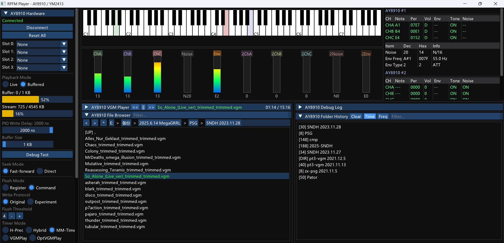

# RPFM — RP2350A Sound Chip Player

RPFM is a retro sound chip hardware player based on the RP2350A, succeeding the [SPFM (Serial Port FM)](https://github.com/gtlabJP/SPFM) series. It drives YM2413, AY8910, and other classic sound chips with PIO-precise timing for hardware-level VGM playback.



## Features

- **Dual-core VGM playback** — Core 0 handles USB HID communication; Core 1 runs a MegaGRRL-style cycle counter loop for 44100 Hz sample-accurate timing
- **PIO parallel bus** — 14-bit parallel bus drives sound chips directly with software-controlled nanosecond write timing
- **Tick-synced visualization** — Firmware reports current playback tick; host applies shadow register updates in lockstep
- **Live / Buffered dual mode** — Live mode writes registers in real time; Buffered mode streams raw VGM data to firmware
- **USB HID 64-byte frame protocol** — Built-in flow control, CRC8 integrity, no CDC buffer overflow
- **One-click flashing** — HID BOOTSEL command enters flash mode without pressing buttons
- **Multi-chip support** — Independent chip selects for YM2413 (OPLL) / AY8910 (PSG); YM2151/YM2612 planned

## Hardware Architecture

```
PC (Host) ──USB HID──→ RP2350A (Device) ──PIO──→ Sound Chip → Analog Audio
                             │
                        ┌────┴────┐
                        │ Core 0  │  USB HID callback, tud_task(), LED, deferred writes
                        │ Core 1  │  VGM tight loop, cycle counter, PIO register writes
                        └─────────┘
```

### GPIO Pinout

| GPIO | Function | Description |
|------|----------|-------------|
| GPIO0–7 | D0–D7 | 8-bit data bus |
| GPIO8 | WR# | Write strobe (active low) |
| GPIO9 | RD# | Read strobe (active low) |
| GPIO10–13 | A0–A3 | Address lines |
| GPIO16 | WS2812 | Onboard RGB LED (chip-select indicator) |
| GPIO17–20 | CS0–CS3 | 4-bit chip select |
| GPIO21 | IC# | Global reset |
| GPIO25 | LED | Heartbeat indicator |

### Level Shifting

RP2350A 3.3 V GPIO is shifted to 5 V through a 74LVC245, driving YM2413 and other legacy 5 V chips.

## Communication Protocol

USB HID 64-byte frame protocol:

```
Downlink frame (PC → RP2350A):
  [0]     CMD       Command byte
  [1]     SEQ       Sequence number (0–255)
  [2]     LEN       Payload length (0–60)
  [3..62] PAYLOAD
  [63]    CRC8      Polynomial 0x31

Uplink frame (RP2350A → PC):
  [0]     ACK       = SEQ
  [1]     STATUS    bit0=playing, bit1=buffer>75%, bit2=error
  [2..3]  BUF_LVL   Buffer level (uint16 LE)
  [4..7]  TICK      Current playback tick (uint32 LE, 44100 Hz)
```

### Command List

| CMD | Name | Description |
|-----|------|-------------|
| 0x01 | WRITE_REG | YM2413 register write (20 µs timing) |
| 0x08 | WRITE_AY | AY8910 register write (adjustable timing) |
| 0x04 | VGM_DATA | Raw VGM byte stream |
| 0x05 | VGM_START | Start VGM playback |
| 0x06 | VGM_STOP | Stop VGM playback |
| 0x21 | SET_DELAY | Set AY8910 /WR pulse width (100 ns units) |
| 0x20 | BOOTSEL | Enter BOOTSEL flash mode |
| 0x03 | RESET | Hardware reset (IC#) |

See [docs/RPFM_HID_PROTOCOL.md](docs/RPFM_HID_PROTOCOL.md) for details.

## VGM Playback Engine

### Core 1 Precise Timing

Inspired by the MegaGRRL (ESP32) approach, Core 1 runs a tight polling loop:

```c
while (true) {
    if (!(s_status & STATUS_PLAYING)) continue;

    uint64_t cc = timer_hw->timerawl;   // 64-bit µs hardware counter
    cycle_us += (cc - last_cc);
    uint64_t sample = cycle_us * 44100ULL / 1000000ULL;

    if (sample >= next_sample) {
        process_vgm_commands();         // parse, write PIO, advance tick
        s_vgm_tick = next_sample;       // report to host
    }
}
```

- `timer_hw->timerawl` is a 64-bit hardware µs counter readable by both cores, immune to interrupts
- Core 1 dedicated tight loop — no USB HID preemption
- AY8910 PIO blocking writes do not affect Core 0 USB communication

### Tick Synchronization

After processing VGM commands, the firmware updates `s_vgm_tick` (current sample position) and reports it in every HID response. The host parses the VGM byte stream in parallel, tracking sample ticks, and queues shadow register updates. Only updates whose tick ≤ the firmware-reported tick are applied:

```
Host parses VGM → enqueue {reg, data, tick}
                        ↓
Firmware HID response → fwTick
                        ↓
flushTo(fwTick) → apply shadow registers → UI visualization
```

See [docs/BUFFER_SIZE_SLIDER_AND_SHADOW_REG_SYNC.md](docs/BUFFER_SIZE_SLIDER_AND_SHADOW_REG_SYNC.md).

### AY8910 PIO Write Timing

Each register write takes 7 PIO words, with software-controlled delay:

```
word 1: addr on bus, A0=0, /WR=high  (address setup)
word 2: addr on bus, A0=0, /WR=low   (address latch)  ← delay
word 3: addr on bus, A0=0, /WR=high  (address hold)
word 4: data on bus, A0=1, /WR=high  (data setup)
word 5: data on bus, A0=1, /WR=low   (data latch)     ← delay
word 6: data on bus, A0=1, /WR=high  (data hold)
word 7: idle (0x03FF)
```

Default /WR pulse is 1 µs, adjustable in real time via the host slider (0–2000 ns).
See [docs/TIMING_TUNING.md](docs/TIMING_TUNING.md).

## Host Application (RPFM Player)

Windows desktop player built with Dear ImGui, supporting AY8910 live/buffered dual-mode playback.

### Features

- **Piano keyboard** — real-time note display, multi-channel colored keys, portamento/vibrato indicators
- **Level meters** — per-channel level bars with dB scale, click-to-mute/solo
- **Register table** — live shadow register view: tone, noise, mixer, volume, envelope
- **Oscilloscope** — configurable waveform display
- **Playback controls** — VGM file loading, play/pause/stop, progress bar, loop support
- **Sidebar config** — PIO delay adjustment, buffer size (64 B–2 KB), playback mode, clock correction
- **Tick display** — firmware playback position / total ticks with time readout
- **Config persistence** — all sidebar settings saved to `ay8910_config.ini`

### Build

```bash
cd RPFM_Player
mkdir build2 && cd build2
cmake ..
cmake --build . --config Release
```

Output: `bin/rpfm_player.exe`

## Firmware Build & Flash

### Prerequisites

- Pico SDK 2.2.0 (included in repo)
- ARM GCC cross-compiler (`arm-none-eabi-gcc`)
- CMake + Make

### Build

```bash
mkdir build_rpfm && cd build_rpfm
cmake ..
cmake --build .
```

Output: `rpfm.uf2`

### Flash

```bash
# Automatic (HID BOOTSEL)
bash scripts/flash_rpfm.sh

# Manual: hold BOOTSEL, plug USB, copy UF2 to RPI-RP2 drive
cp build_rpfm/rpfm.uf2 /path/to/RPI-RP2/
```

## Project Structure

```
RPFM/
├── src/rpfm/                   Firmware source
│   ├── main.c                  Entry point, HID callback, deferred queue, main loop
│   ├── vgm_player.h            Core 1 VGM playback engine (cycle counter)
│   ├── spfm_bus.pio            PIO 14-bit parallel bus driver
│   ├── pio_cs.pio              PIO 4-bit chip-select output
│   ├── ws2812.pio              PIO WS2812 LED driver
│   ├── protocol.h              HID frame format + CRC8
│   └── command_buffer.h        Ring buffer for VGM streaming
├── RPFM_Player/                 Windows host application
│   ├── src/
│   │   ├── ay8910_window.cpp   AY8910 main window (UI + VGM playback)
│   │   ├── rpfm_hid.cpp/h      HID communication layer
│   │   └── rpfm_protocol.h     Protocol constants
│   └── bin/                    Build output
├── scripts/                    Build/flash scripts
│   ├── flash_rpfm.sh           HID auto-flash
│   └── build.sh                Build script
├── docs/                       Design documents
│   ├── ARCHITECTURE.md         System architecture
│   ├── CORE1_VGM_PLAYER_PLAN.md     Core 1 player design
│   ├── RPFM_HID_PROTOCOL.md         HID protocol details
│   ├── TIMING_TUNING.md              Timing adjustment history
│   └── BUFFER_SIZE_SLIDER_AND_SHADOW_REG_SYNC.md  Tick sync design
├── pics/                       Images
│   └── overview.png
└── reference/                  Reference code (MegaGRRL, AY-3-8910, etc.)
```

## Chip Support

| Chip | Status | Notes |
|------|--------|-------|
| YM2413 (OPLL) | ✅ Verified | 20 µs PIO write timing |
| AY8910 (PSG) | ✅ Verified | Adjustable PIO timing, Core 1 VGM playback |
| YM2151 (OPM) | 🔜 Planned | 8-channel FM |
| YM2612 (OPN2) | 🔜 Planned | 6-channel FM + DAC |
| YM2203 (OPN) | 🔜 Planned | 3 FM + 3 SSG |
| YM2608 (OPNA) | 🔜 Planned | 6 FM + 3 SSG + ADPCM |

## History

RPFM is the third generation: IAP-RESPFM (2022, STM32F103) → DIY SPFM (2024, STM32) → RP2350A (2026).

- **2026-05-12** — Project start, PIO parallel bus driving YM2413/AY8910
- **2026-05-12** — USB HID 64-byte frame protocol replacing CDC, fixing overflow crashes
- **2026-05-12** — HID auto-flash via BOOTSEL command
- **2026-05-13** — Core 1 VGM playback engine (MegaGRRL-style cycle counter)
- **2026-05-13** — Host DMPlayer AY8910 window port (SCCI → RPFM HID)
- **2026-05-13** — Tick-synced shadow registers, buffer slider 64 B–2 KB

## License

MIT
